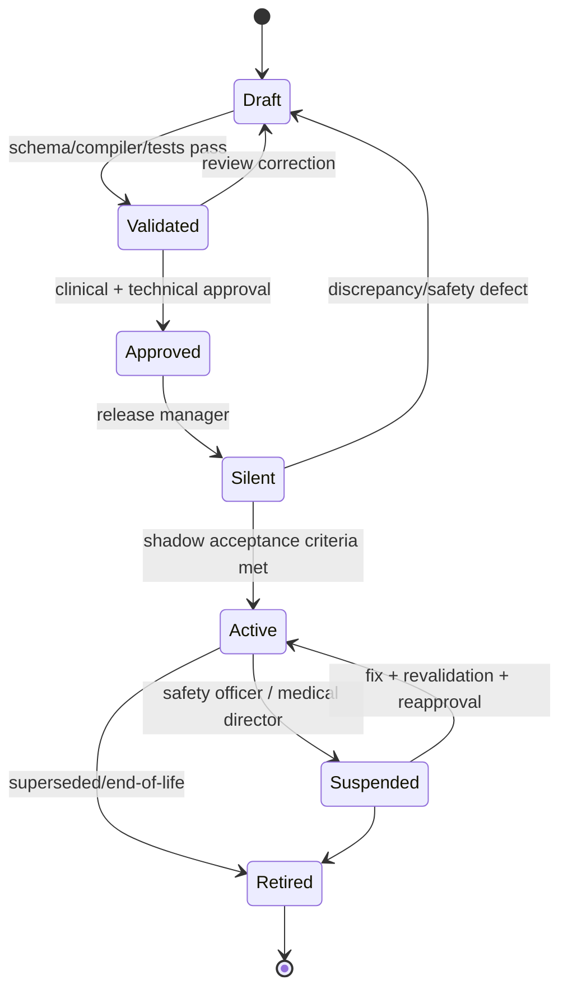
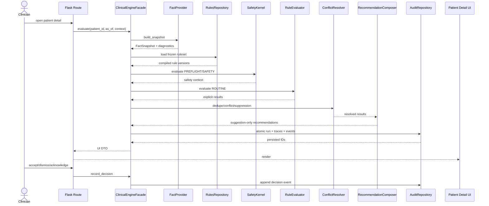

# Diagrams

## Rule lifecycle


## Runtime sequence


## Dual-run
```text
request
  ├─ legacy engine ─────────────────► current UI
  └─ engine v2 shadow
       ├─ fact snapshot
       ├─ safety/evaluation
       ├─ trace/audit
       └─ difference classifier ────► no clinician display
```
