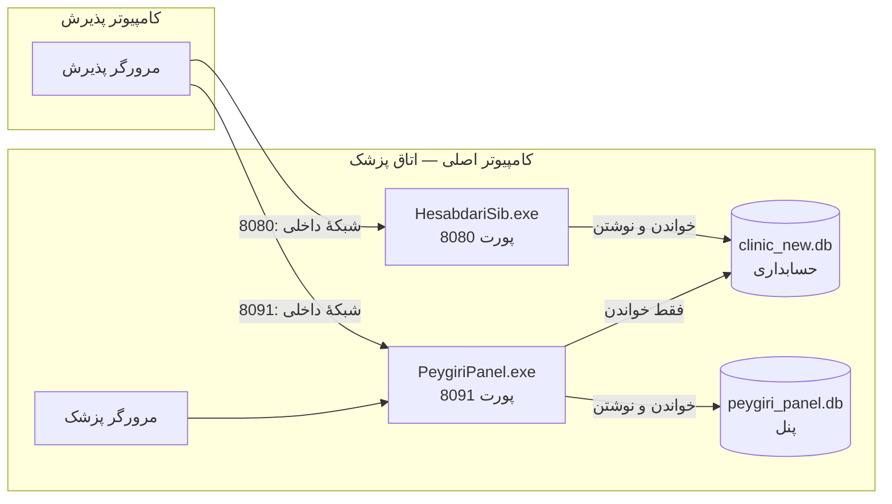
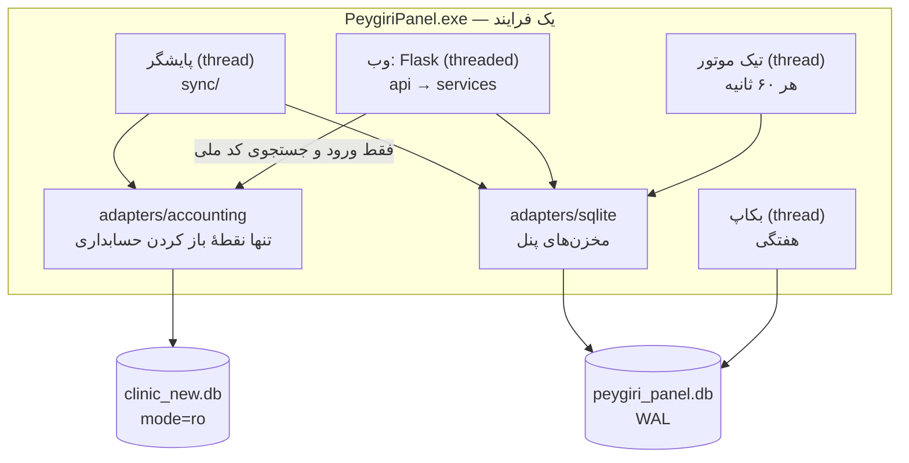
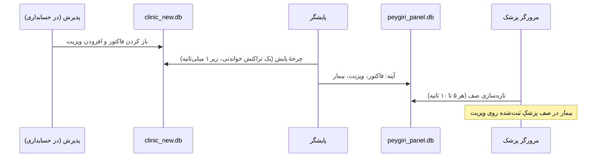
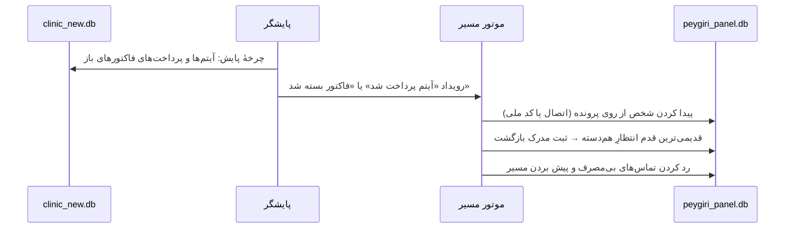

# ۰۲ — معماری

## ۱. نمای کلی



- دو فرایند جدا، دو پورت جدا و دو دیتابیس جدا داریم. تنها نقطهٔ تماس، خواندنِ فایل حسابداری توسط پنل است.
- پورت 8091 انتخاب شد تا با `specialist_clinic` (پورت 8090) هم تداخل نداشته باشد.

## ۲. اجزای داخل فرایند پنل



| جزء | مسئولیت |
|---|---|
| **وب** | صفحه‌ها و API برای سه نقش. فقط از دیتابیس پنل می‌خواند. استثنا: ورود (`users` و `medical_staff`) و جستجوی کد ملی هنگام تکمیل هویت؛ هر دو از طریق پل |
| **پایشگر** | هر ۵ ثانیه یک چرخهٔ خواندنی روی حسابداری اجرا می‌کند ([03](03-accounting-bridge.md))، آینه را به‌روز می‌کند و رویدادهای دامنه را به موتور مسیر می‌دهد |
| **تیک موتور** | گذارهای زمان‌محور: موعد تماس، پایان پنجرهٔ انتظار، انقضای ۳۰ روزه. بعد از هر تغییر روز هم اجرا می‌شود |
| **بکاپ** | کپی سازگار دیتابیس پنل با API بکاپ SQLite، هفتگی و پیش از هر ارتقای اسکیما. ۴ نسخهٔ آخر نگه داشته می‌شود |

## ۳. لایه‌ها و ساختار کد

همان قراردادهای `webapp` (api ← services ← adapters)، با چند قید سخت‌گیرانه‌تر:

```
پنل پیگیری/
  start.py                      ورود برنامه (منبع و exe)
  PeygiriPanel.spec             PyInstaller
  src/
    app.py                      create_app، ثبت blueprintها، شروع threadها
    config/                     خواندن و ساخت config.ini، ثابت‌ها
    api/                        auth، doctor، reception، manager، health — فقط درخواست و پاسخ و دسترسی
    services/                   journey_engine، identity، walkin، cutoffs، calls، returns، reports، auth
    domain/                     dataclassها و منطق خالص: ماشین حالت مسیر، اعتبارسنجی کد ملی، نرمال‌سازی متن فارسی
    sync/                       poller (حلقه)، differ (مقایسهٔ آینه و تولید رویداد)
    adapters/
      accounting/               bridge.py (اتصال امن)، reader.py (قرارداد کوئری‌ها)، schema_check.py
      sqlite/                   core.py (اتصال، migration)، schema.sql، یک مخزن برای هر aggregate
    common/                     iran_time، jalali، persian_text
    templates/  static/         Jinja و دارایی‌های محلی (Vazirmatn، jalaali.js) — بدون CDN
  journeys/                     تعریف پیش‌فرض الگوهای مسیر (JSON)، بارگذاری در اولین اجرا
  tests/
```

**قواعد وابستگی** (با «آزمون معماری» در `tests/` اجرا می‌شوند):
1. فقط `adapters/accounting/` مسیر فایل حسابداری را می‌شناسد و به آن وصل می‌شود.
2. هیچ ماژولی از `webapp` یا `specialist_clinic` import نمی‌شود.
3. `domain/` به Flask، SQLite و ساعت سیستم وابسته نیست. زمان به‌صورت پارامتر به آن داده می‌شود تا آزمون‌پذیر بماند.
4. SQL فقط در `adapters/` نوشته می‌شود.

## ۴. جریان‌های زمان اجرا

### ۴-۱. ویزیت تا صف پزشک



### ۴-۲. پنل پزشک تا مسیر
پزشک گزینه‌ها را انتخاب می‌کند و این اتفاق‌ها می‌افتد:
1. در یک تراکنش: `encounter` ثبت می‌شود، برچسب‌های مزمن به‌روز می‌شوند، `measurement` (اگر عددی وارد شده) ثبت می‌شود، و برای هر مسیر انتخاب‌شده یک `journey` با قدم‌هایش ساخته می‌شود.
2. اگر شخص شناخته‌شده نباشد، مسیرها در وضعیت `awaiting_identity` می‌مانند و پذیرش هشدار هویت می‌گیرد.

### ۴-۳. کاغذ پرستار تا اقدام
پذیرش فهرست مراجعه‌های پرستاری را باز می‌کند و فرم را پر می‌کند. سپس:
1. هویت تکمیل یا اتصال داده می‌شود.
2. `walkin_entry` و `measurement` ثبت می‌شوند.
3. کات‌آف تأییدشده اجرا می‌شود و یک یا چند اقدام تولید می‌کند: سری کنترل و/یا دعوت به ویزیت.
4. اگر بیمار دارو مصرف می‌کند و تاریخ تمدید ثبت شده، مسیر تمدید هم ساخته می‌شود.

### ۴-۴. تشخیص بازگشت



اگر فاکتور ناشناس باشد (بدون کد ملی و بدون اتصال قبلی):
- برای شخص‌هایی که در ±۷ روز انتظار مراجعه دارند، با موبایل و نام خانوادگی «پیشنهاد تطبیق» ساخته می‌شود و پذیرش با یک کلیک تأیید یا رد می‌کند.
- پذیرش می‌تواند از فهرست «انتظار امروز» هم دستی اتصال دهد.

### ۴-۵. حذف در حسابداری
اگر آیتمی از فاکتور باز حذف شود، در آینه علامت «حذف‌شده» می‌گیرد. سپس:
- اگر مدرک بازگشت بوده، مدرک باطل می‌شود و قدم برمی‌گردد.
- اگر ویزیتِ مبدأ یک پنل ثبت‌شده بوده، مسیرهای آن پنل به `needs_review` می‌روند.

حسابداری اجازهٔ تغییر فاکتور بسته را نمی‌دهد. پس با بسته شدن فاکتور، وضعیت آن نهایی است (جزئیات در [03](03-accounting-bridge.md) §۷).

## ۵. همروندی

- **یک فرایند و یک پایشگر.** `use_reloader=False` است و یک نگهبان «تک‌نمونه» داریم: اگر پورت 8091 در حال استفاده باشد، exe دوم فقط مرورگر را باز می‌کند و خارج می‌شود.
- **دیتابیس پنل در حالت WAL** است، با `busy_timeout=5000` و `foreign_keys=ON`. نوشتن‌ها تراکنش کوتاه دارند.
- **اتصال‌ها:** هر درخواست وب اتصال جدا دارد (الگوی `g`، مانند حسابداری) و هر thread هم اتصال خودش را دارد.
- **موتور مسیر idempotent است.** پردازش دوبارهٔ یک رویداد نتیجه را تغییر نمی‌دهد. کلیدهای یکتا جلوی تکرار را می‌گیرند، مثلاً هر آیتم حسابداری حداکثر یک مدرک بازگشت دارد.
- **خواندن حسابداری** همیشه در یک تراکنش جدا و کوتاه انجام می‌شود و هرگز با نوشتن در دیتابیس پنل در یک تراکنش ترکیب نمی‌شود. اول از حسابداری خوانده می‌شود، اتصال بسته می‌شود، بعد در پنل نوشته می‌شود.

## ۶. زمان و تقویم

- ساعت ایران ثابت UTC+3:30 است (ایران از ۱۴۰۱ تغییر ساعت ندارد). همان روش حسابداری استفاده می‌شود: `datetime.now(timezone.utc) + 3:30`، مستقل از ساعت سیستم‌عامل.
- زمان‌ها به‌صورت رشتهٔ `YYYY-MM-DD HH:MM:SS` به وقت تهران ذخیره می‌شوند، با همان قالب حسابداری.
- تاریخ‌ها در دیتابیس میلادی و در رابط کاربری جلالی‌اند (`jdatetime` در سرور و `jalaali.js` محلی در مرورگر).
- «روز» مسیرها تاریخ تقویمی تهران است. صف پزشک از `work_date` و `shift` حسابداری پیروی می‌کند.

## ۷. استقرار

**چیدمان روی کامپیوتر اصلی** (پوشهٔ دلخواه، جدا از پوشهٔ حسابداری):

```
PeygiriPanel\
  PeygiriPanel.exe
  config.ini              در اولین اجرا ساخته می‌شود
  peygiri_panel.db        (+ -wal و -shm)
  backups\
  logs\
```

**config.ini:**

```ini
[accounting]
db_path = C:\HesabdariSib\clinic_new.db   ; مسیر فایل دیتابیس حسابداری

[server]
host = 0.0.0.0          ; برای دسترسی کامپیوتر پذیرش
port = 8091
open_browser = true
allowed_clients =       ; اختیاری: فهرست IPهای مجاز، مثلاً 127.0.0.1, 192.168.1.20

[sync]
poll_seconds = 5        ; ۵ تا ۱۰
read_budget_ms = 200    ; سقف سخت هر چرخهٔ خواندن
busy_timeout_ms = 250   ; اگر حسابداری مشغول بود، تا این زمان صبر و سپس رد کردن چرخه

[app]
secret_key =            ; خالی: در اولین اجرا تصادفی ساخته و ذخیره می‌شود
```

**ترتیب شروع:**
1. خواندن یا ساختن `config.ini`.
2. باز کردن دیتابیس پنل. اگر نسخهٔ اسکیما عوض شده باشد: بکاپ و سپس migration.
3. بررسی اسکیمای حسابداری، فقط‌خواندنی. اگر ناسازگار باشد، پل غیرفعال می‌شود و بنر خطا نمایش داده می‌شود؛ بقیهٔ برنامه کار می‌کند.
4. شروع threadها.
5. شروع وب‌سرور.
6. باز کردن مرورگر پس از ۱٫۵ ثانیه، مانند حسابداری.

**نکات استقرار:**
- **فایروال ویندوز:** در اولین اجرا، دسترسی «شبکهٔ خصوصی» برای پورت 8091 مجاز شود.
- **ساخت exe:** با همان Python 3.13 که build موجود حسابداری (`webapp/build`) با آن ساخته شده، تا اجرای exe روی همان کامپیوتر قطعی باشد.
- **توقف:** exe پنجرهٔ کنسول ندارد. توقف با دکمهٔ «توقف برنامه» در صفحهٔ مدیر (فقط از کامپیوتر اصلی) یا از Task Manager انجام می‌شود.
- **ارتقا:** توقف، جایگزینی exe، اجرا. بکاپ پیش از migration خودکار است.
- **بازگشت به نسخهٔ قبل:** exe قبلی و آخرین بکاپ. حسابداری در هیچ حالتی تحت تأثیر نیست.

## ۸. امنیت و حریم خصوصی

| موضوع | تصمیم |
|---|---|
| شبکه | فقط شبکهٔ داخلی، بدون هیچ اتصال بیرونی در فاز ۱. فهرست IPهای مجاز اختیاری است |
| نشست | کوکی HttpOnly و SameSite=Lax، عمر ۸ ساعت. چون اتصال HTTP داخلی است، Secure ندارد |
| CSRF | توکن نشست در همهٔ فرم‌ها و درخواست‌های `fetch` از نوع POST |
| رمزها | پزشکان: bcrypt در دیتابیس پنل. پذیرش و مدیر: بررسی فقط‌خواندنیِ hash حسابداری؛ hash غیر-bcrypt رد می‌شود و کاربر یک بار در حسابداری وارد می‌شود تا hash آنجا مهاجرت کند |
| قفل ورود | ۵ تلاش و ۱۵ دقیقه، با شمارندهٔ داخل پنل. قفل حسابداری (`locked_until`) هم رعایت می‌شود |
| دسترسی | ماتریس نقش‌ها در [06](06-screens-and-roles.md). همهٔ مسیرهای API نقش را بررسی می‌کنند |
| ممیزی | `audit_log` برای هر تغییر وضعیت: کاربر، زمان، قبل و بعد |
| دادهٔ بیمار | فقط روی کامپیوتر اصلی و بکاپ‌های محلی. کد ملی در فهرست‌ها ماسک‌شده نمایش داده می‌شود. کپی دیتابیس واقعی هرگز در git یا fixtureهای آزمون قرار نمی‌گیرد |

## ۹. مشاهده‌پذیری

- **لاگ:** `logs/peygiri_panel.log`، چرخشی، ۵ فایل یک‌مگابایتی. شامل خطاها، چرخه‌های ردشده با علت، ورودها و migrationها.
- **`/health` (برای مدیر):**
  - زمان آخرین چرخهٔ موفق
  - میانه و صدک ۹۹ زمان چرخه
  - تعداد خطاهای پیاپی
  - وضعیت بررسی اسکیمای حسابداری
  - حجم دیتابیس پنل
  - زمان آخرین بکاپ
- **نشانگر سربرگ:** سبز اگر کمتر از ۱۵ ثانیه از آخرین چرخهٔ موفق گذشته باشد، زرد تا ۶۰ ثانیه، و قرمز بیش از آن.

## ۱۰. حالت‌های خرابی

| رخداد | رفتار پنل | اثر روی حسابداری |
|---|---|---|
| حسابداری مشغول نوشتن است | صبر حداکثر ۲۵۰ میلی‌ثانیه، سپس رد کردن چرخه و ثبت در لاگ | ندارد |
| چرخه از سقف ۲۰۰ میلی‌ثانیه بگذرد | قطع کوئری، رد کردن چرخه، ثبت در لاگ | ندارد |
| فایل حسابداری پیدا نشود | نشانگر قرمز و بنر؛ صفحه‌ها با دادهٔ آینه کار می‌کنند | ندارد |
| journal داغ (حسابداری وسط نوشتن crash کرده) | خطای فقط‌خواندنی، رد کردن چرخه؛ حسابداری در اتصال بعدی خودش بازیابی می‌کند | ندارد |
| تغییر اسکیمای حسابداری (نسخهٔ جدید exe) | ستون‌های تازه بی‌اثرند چون ستون‌ها صریح خوانده می‌شوند. ستون یا جدول لازمی که حذف شده باشد پل را غیرفعال می‌کند و بنر نمایش داده می‌شود | ندارد |
| پنل crash کند | حسابداری عادی کار می‌کند. پس از اجرای دوباره، پایشگر از watermark ادامه می‌دهد | ندارد |
| دیتابیس پنل خراب شود | بازگردانی از بکاپ هفتگی. آینه از حسابداری دوباره ساخته می‌شود | ندارد |

## ۱۱. تصمیم‌های کلیدی

| ADR | موضوع |
|---|---|
| [0001](adr/0001-independent-app.md) | برنامه، فرایند و دیتابیس مستقل؛ بدون import از webapp |
| [0002](adr/0002-read-only-bridge.md) | پل فقط‌خواندنی SQLite با سقف زمانی و رد کردن چرخه هنگام مشغولی |
| [0003](adr/0003-incremental-polling.md) | پایش افزایشی با watermark و مجموعهٔ تحت‌نظر؛ صفحه‌ها فقط از آینه می‌خوانند |
| [0004](adr/0004-identity.md) | هویت بر پایهٔ کد ملی؛ چند پرونده برای یک شخص؛ اتباع خارج |
| [0005](adr/0005-journey-engine.md) | موتور مسیر داده‌محور: الگوهای نسخه‌دار و قدم‌های تماس و انتظار |
| [0006](adr/0006-return-by-payment.md) | بازگشت = پرداخت خدمت مورد انتظار؛ هر پزشکی؛ ثبت پزشک مبدأ و انجام‌دهنده |
| [0007](adr/0007-authentication.md) | ورود از دو منبع: حسابداری برای پذیرش و مدیر، حساب محلی تأییدشده برای پزشک |
| [0008](adr/0008-stack-and-packaging.md) | Flask، Jinja، SQLite و PyInstaller؛ همسان با حسابداری |
| [0009](adr/0009-clinical-cutoffs.md) | کات‌آف‌های نسخه‌دار با تأیید پزشک مدیر |
| [0010](adr/0010-identity-enforcement.md) | اجبار هویت بدون تغییر در حسابداری |
