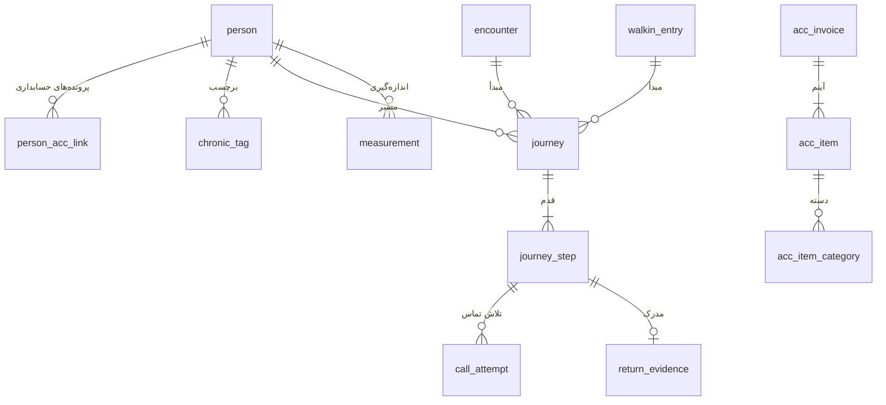

# ۰۴ — مدل داده (دیتابیس پنل)

دیتابیس پنل `peygiri_panel.db` فایل SQLite در حالت WAL است و کنار exe قرار دارد. این دیتابیس کاملاً از حسابداری جداست. شناسه‌های حسابداری فقط به‌صورت عدد ارجاعی نگه داشته می‌شوند و نام ستون‌هایشان پیشوند `acc_` دارد. هیچ کلید خارجی‌ای بین دو دیتابیس وجود ندارد.

## ۱. قواعد کلی

- **قالب زمان:** `YYYY-MM-DD HH:MM:SS` به وقت تهران. **قالب تاریخ:** `YYYY-MM-DD` میلادی (نمایش جلالی فقط در رابط کاربری است).
- **کاربر:** ستون‌های `*_by` نام کاربری را نگه می‌دارند. برای پزشک: `doctor:<username>`. برای کاربر حسابداری: `acc:<username>`.
- **مقادیر شمارشی** با `CHECK` محدود می‌شوند. فهرست کامل در §۹ آمده است.
- **migration:** `schema.sql` منبع حقیقت است و همهٔ دستورهایش `IF NOT EXISTS` دارند. نسخهٔ اسکیما در `schema_meta.version` ثبت می‌شود. تغییرات افزایشی و قابل اجرای دوباره هستند و پیش از هر migration یک بکاپ خودکار گرفته می‌شود. این همان روش `webapp` است، به‌علاوهٔ شمارهٔ نسخه.
- `PRAGMA foreign_keys = ON`، `journal_mode = WAL`، `busy_timeout = 5000`.

### نسخهٔ فعلی اسکیما

نسخهٔ ۲ (M1): ستون `acc_item.item_at` برای زمان و ترتیب ویزیت‌ها اضافه شد. ارتقای نصب M0 نسخهٔ ۱، پیش از تغییر بکاپ می‌گیرد، ستون را افزایشی اضافه می‌کند و اطلاعات قبلی را حفظ می‌کند. اجرای دوبارهٔ ارتقا بی‌اثر است.

## ۲. نمودار ارتباطات اصلی



## ۳. هویت

```sql
CREATE TABLE IF NOT EXISTS person (
  id                  INTEGER PRIMARY KEY,
  national_id         TEXT NOT NULL UNIQUE CHECK (length(national_id) = 10),  -- رقم کنترل در کد بررسی می‌شود
  first_name          TEXT NOT NULL,
  last_name           TEXT NOT NULL,
  mobile              TEXT NOT NULL CHECK (length(mobile) = 11 AND substr(mobile, 1, 2) = '09'),
  has_personal_device INTEGER NOT NULL DEFAULT 0,          -- D23؛ برای پایش از راه دور در فاز ۲
  created_at TEXT NOT NULL, created_by TEXT NOT NULL,
  updated_at TEXT NOT NULL, updated_by TEXT NOT NULL
);
CREATE INDEX IF NOT EXISTS ix_person_mobile ON person(mobile);           -- فقط برای پیشنهاد تطبیق؛ یکتا نیست

-- چند پروندهٔ حسابداری می‌توانند به یک شخص متصل باشند (پرونده‌های تکراری حسابداری)
CREATE TABLE IF NOT EXISTS person_acc_link (
  acc_patient_id INTEGER PRIMARY KEY,                       -- patients.id حسابداری
  person_id      INTEGER NOT NULL REFERENCES person(id),
  method         TEXT NOT NULL CHECK (method IN ('auto_nid','manual','suggestion')),
  linked_at TEXT NOT NULL, linked_by TEXT NOT NULL
);
CREATE INDEX IF NOT EXISTS ix_link_person ON person_acc_link(person_id);

CREATE TABLE IF NOT EXISTS chronic_tag (
  person_id       INTEGER NOT NULL REFERENCES person(id),
  tag             TEXT NOT NULL CHECK (tag IN ('diabetes','hypertension')),
  status          TEXT NOT NULL CHECK (status IN ('active','removed')),
  set_by_staff_id INTEGER NOT NULL,                         -- medical_staff.id پزشک
  set_at          TEXT NOT NULL,
  PRIMARY KEY (person_id, tag)
);

-- هشدار هویتی که پذیرش آگاهانه بسته است (مثلاً بیمار تبعهٔ خارجی است)
CREATE TABLE IF NOT EXISTS identity_dismissal (
  acc_invoice_id INTEGER PRIMARY KEY,
  reason         TEXT NOT NULL CHECK (reason IN ('foreign','not_needed')),
  by_user TEXT NOT NULL, at TEXT NOT NULL
);
```

## ۴. ثبت بالینی

```sql
-- تکمیل پنل پزشک برای یک ویزیت
CREATE TABLE IF NOT EXISTS encounter (
  id              INTEGER PRIMARY KEY,
  acc_visit_id    INTEGER NOT NULL UNIQUE,
  acc_invoice_id  INTEGER NOT NULL,
  acc_patient_id  INTEGER NOT NULL,
  person_id       INTEGER REFERENCES person(id),             -- NULL تا تکمیل هویت
  doctor_staff_id INTEGER NOT NULL,                          -- پزشک مبدأ
  decision        TEXT NOT NULL CHECK (decision IN ('no_followup','followup')),
  note            TEXT CHECK (note IS NULL OR length(note) <= 200),
  status          TEXT NOT NULL DEFAULT 'ok' CHECK (status IN ('ok','source_deleted')),
  chronic_tags    TEXT,                                      -- JSON {"diabetes": true, …}؛ با تکمیل هویت روی شخص اعمال می‌شود
  created_at TEXT NOT NULL, updated_at TEXT NOT NULL         -- ویرایش تا پایان همان روز
);

-- ورود اطلاعات کاغذ پرستار برای مراجعه‌ای که ویزیت ندارد
CREATE TABLE IF NOT EXISTS walkin_entry (
  id                INTEGER PRIMARY KEY,
  acc_invoice_id    INTEGER NOT NULL UNIQUE,
  acc_patient_id    INTEGER NOT NULL,
  person_id         INTEGER REFERENCES person(id),
  nurse_staff_id    INTEGER,                                 -- از injections.nurse_id (۱۰۰٪ پر است)
  status            TEXT NOT NULL CHECK (status IN ('entered','no_paper','foreign_excluded')),
  cutoff_ruleset_id INTEGER REFERENCES cutoff_ruleset(id),   -- نسخه‌ای از کات‌آف که اعمال شد؛ NULL یعنی هنوز تأییدشده‌ای نبود
  entered_by TEXT NOT NULL, entered_at TEXT NOT NULL
);

CREATE TABLE IF NOT EXISTS measurement (
  id                  INTEGER PRIMARY KEY,
  person_id           INTEGER REFERENCES person(id),
  source              TEXT NOT NULL CHECK (source IN ('encounter','walkin')),
  encounter_id        INTEGER REFERENCES encounter(id),
  walkin_entry_id     INTEGER REFERENCES walkin_entry(id),
  kind                TEXT NOT NULL CHECK (kind IN ('bp','bs')),
  systolic            INTEGER,
  diastolic           INTEGER,
  glucose             INTEGER,
  glucose_type        TEXT CHECK (glucose_type IN ('fasting','random')),
  on_medication       INTEGER CHECK (on_medication IN (0,1)),
  approx_renewal_date TEXT,                                  -- زمان تقریبی تمدید نسخه (پرسیده از بیمار)
  measured_at TEXT NOT NULL, recorded_by TEXT NOT NULL,
  CHECK ((kind = 'bp' AND systolic IS NOT NULL AND diastolic IS NOT NULL AND glucose IS NULL)
      OR (kind = 'bs' AND glucose IS NOT NULL AND glucose_type IS NOT NULL AND systolic IS NULL))
);
CREATE INDEX IF NOT EXISTS ix_measurement_person ON measurement(person_id, measured_at);
```

## ۵. مسیرها، تماس‌ها، بازگشت

```sql
CREATE TABLE IF NOT EXISTS journey_template (
  code       TEXT NOT NULL,
  version    INTEGER NOT NULL,
  title      TEXT NOT NULL,
  definition TEXT NOT NULL,              -- JSON، قالب در 05-journeys.md §۷
  is_enabled INTEGER NOT NULL,
  is_current INTEGER NOT NULL,           -- فقط یک نسخهٔ جاری برای هر code
  changed_by TEXT NOT NULL, changed_at TEXT NOT NULL,
  PRIMARY KEY (code, version)
);
CREATE UNIQUE INDEX IF NOT EXISTS ux_template_current ON journey_template(code) WHERE is_current = 1;

CREATE TABLE IF NOT EXISTS journey (
  id                     INTEGER PRIMARY KEY,
  person_id              INTEGER REFERENCES person(id),     -- NULL فقط در awaiting_identity
  template_code          TEXT NOT NULL,
  template_version       INTEGER NOT NULL,                  -- مسیر با همان نسخه‌ای که ساخته شده ادامه می‌دهد
  params                 TEXT NOT NULL,                     -- JSON: interval_months، count، every_days، تاریخ‌ها و …
  origin_kind            TEXT NOT NULL CHECK (origin_kind IN ('encounter','walkin','continuation')),
  origin_id              INTEGER,                           -- encounter.id یا walkin_entry.id یا journey.id
  origin_acc_invoice_id  INTEGER,                           -- بازگشت روی این فاکتور حساب نمی‌شود
  origin_doctor_staff_id INTEGER,                           -- برای سهم پزشک مبدأ در فاز ۲
  start_date             TEXT NOT NULL,                     -- روز صفر مسیر (work_date فاکتور مبدأ)
  status                 TEXT NOT NULL CHECK (status IN ('awaiting_identity','active','needs_review','succeeded','partial','failed','cancelled')),
  close_reason           TEXT CHECK (close_reason IN ('refused','unreachable','expired','lab_not_done','foreign','duplicate','manual')),
  created_at TEXT NOT NULL, created_by TEXT NOT NULL, closed_at TEXT
);
CREATE INDEX IF NOT EXISTS ix_journey_person ON journey(person_id, status);
-- در هر الگو، هر شخص حداکثر یک مسیر باز دارد (A14)
CREATE UNIQUE INDEX IF NOT EXISTS ux_journey_open ON journey(person_id, template_code)
  WHERE status IN ('awaiting_identity','active','needs_review') AND person_id IS NOT NULL;

CREATE TABLE IF NOT EXISTS journey_step (
  id          INTEGER PRIMARY KEY,
  journey_id  INTEGER NOT NULL REFERENCES journey(id),
  seq         INTEGER NOT NULL,
  kind        TEXT NOT NULL CHECK (kind IN ('call','expect')),
  due_date    TEXT NOT NULL,             -- call: روز تماس؛ expect: شروع پنجره
  window_end  TEXT,                      -- فقط برای expect
  category    TEXT CHECK (category IN ('visit','bs_test','bp_check','dressing','suture_removal','ear_irrigation','nebulizer')),
  purpose     TEXT NOT NULL,             -- کلید متن تماس یا شرح قدم، مثلاً 'renewal_reminder'
  status      TEXT NOT NULL CHECK (status IN ('pending','done','skipped','missed','cancelled')),
  attempts    INTEGER NOT NULL DEFAULT 0,
  resolved_at TEXT,
  accept_early   INTEGER NOT NULL DEFAULT 0,  -- M4: بازگشتِ پیش از due_date هم پذیرفته است
  recall_on_miss INTEGER NOT NULL DEFAULT 0,  -- G7: پایان پنجره بدون مدرک ← تماس «missed»
  completes      INTEGER NOT NULL DEFAULT 0,  -- انجامش مسیر را تمام می‌کند (کشیدن بخیه)
  about_category TEXT,                        -- برای تماس missed/no_show: چه خدمتی از دست رفت
  UNIQUE (journey_id, seq),
  CHECK ((kind = 'call' AND category IS NULL) OR (kind = 'expect' AND category IS NOT NULL AND window_end IS NOT NULL))
);
CREATE INDEX IF NOT EXISTS ix_step_worklist ON journey_step(kind, status, due_date);

CREATE TABLE IF NOT EXISTS call_attempt (
  id          INTEGER PRIMARY KEY,
  step_id     INTEGER NOT NULL REFERENCES journey_step(id),
  outcome     TEXT NOT NULL CHECK (outcome IN ('booked','no_answer','refused','lab_not_done')),
  booked_date TEXT,                      -- الزامی وقتی outcome = 'booked'
  note        TEXT CHECK (note IS NULL OR length(note) <= 200),
  by_user     TEXT NOT NULL,
  at          TEXT NOT NULL,
  CHECK (outcome <> 'booked' OR booked_date IS NOT NULL)
);
CREATE INDEX IF NOT EXISTS ix_call_step ON call_attempt(step_id);

CREATE TABLE IF NOT EXISTS return_evidence (
  id                     INTEGER PRIMARY KEY,
  journey_id             INTEGER NOT NULL REFERENCES journey(id),
  step_id                INTEGER NOT NULL REFERENCES journey_step(id),
  acc_invoice_id         INTEGER NOT NULL,
  acc_item_type          TEXT NOT NULL CHECK (acc_item_type IN ('visit','injection','procedure')),
  acc_item_id            INTEGER NOT NULL,
  category               TEXT NOT NULL,
  performer_staff_id     INTEGER,         -- پزشک یا پرستار انجام‌دهنده
  origin_doctor_staff_id INTEGER,         -- کپی از journey برای گزارش‌گیری ساده
  amount_snapshot        REAL,            -- قیمت آیتم در لحظهٔ تطبیق (فاز ۲: سود و سهم)
  basis                  TEXT NOT NULL CHECK (basis IN ('paid','zero_total_closed')),
  matched_by             TEXT NOT NULL CHECK (matched_by IN ('auto','reception')),
  matched_at             TEXT NOT NULL,
  revoked_at             TEXT,
  revoke_reason          TEXT CHECK (revoke_reason IN ('item_deleted','payment_removed','manual'))
);
-- هر آیتم حسابداری حداکثر یک مدرک فعال دارد
CREATE UNIQUE INDEX IF NOT EXISTS ux_evidence_item ON return_evidence(acc_item_type, acc_item_id) WHERE revoked_at IS NULL;

CREATE TABLE IF NOT EXISTS match_suggestion (
  id             INTEGER PRIMARY KEY,
  acc_invoice_id INTEGER NOT NULL,
  person_id      INTEGER NOT NULL REFERENCES person(id),
  reason         TEXT NOT NULL,           -- مثلاً 'mobile+last_name'
  status         TEXT NOT NULL CHECK (status IN ('pending','accepted','rejected')),
  created_at TEXT NOT NULL, decided_by TEXT, decided_at TEXT,
  UNIQUE (acc_invoice_id, person_id)
);
```

## ۶. پیکربندی و حساب‌ها

```sql
CREATE TABLE IF NOT EXISTS cutoff_ruleset (
  id                   INTEGER PRIMARY KEY,
  version              INTEGER NOT NULL UNIQUE,
  rules                TEXT NOT NULL,     -- JSON، قالب در 05-journeys.md §۶
  status               TEXT NOT NULL CHECK (status IN ('draft','approved','retired')),
  drafted_by TEXT NOT NULL, drafted_at TEXT NOT NULL,
  approved_by_staff_id INTEGER,           -- حساب «پزشک مدیر»
  approved_at          TEXT,
  CHECK (status <> 'approved' OR (approved_by_staff_id IS NOT NULL AND approved_at IS NOT NULL))
);
CREATE UNIQUE INDEX IF NOT EXISTS ux_cutoff_approved ON cutoff_ruleset(status) WHERE status = 'approved';

CREATE TABLE IF NOT EXISTS setting (
  key TEXT PRIMARY KEY, value TEXT NOT NULL, updated_by TEXT NOT NULL, updated_at TEXT NOT NULL
);  -- پیش‌فرض‌های عمومی، followup_doctor_staff_ids، تغییر دستی شیفت، و …

CREATE TABLE IF NOT EXISTS procedure_category_map (
  normalized_name TEXT PRIMARY KEY,
  category        TEXT CHECK (category IN ('dressing','suture_removal','ear_irrigation')),  -- NULL یعنی «نامرتبط»
  set_by TEXT NOT NULL, set_at TEXT NOT NULL
);

CREATE TABLE IF NOT EXISTS doctor_account (
  id            INTEGER PRIMARY KEY,
  username      TEXT NOT NULL UNIQUE,     -- نباید با نام کاربری‌های حسابداری یکی باشد (A13)
  password_hash BLOB NOT NULL,            -- bcrypt
  staff_id      INTEGER NOT NULL UNIQUE,  -- medical_staff.id؛ در هر ورود از حسابداری تأیید می‌شود
  is_director   INTEGER NOT NULL DEFAULT 0,  -- پزشک مدیر
  is_active     INTEGER NOT NULL DEFAULT 1,
  created_by TEXT NOT NULL, created_at TEXT NOT NULL
);

CREATE TABLE IF NOT EXISTS login_guard (
  username     TEXT PRIMARY KEY,
  failed_count INTEGER NOT NULL DEFAULT 0,
  locked_until TEXT
);
```

## ۷. آینهٔ حسابداری

این بخش فقط کپیِ آنچه پایشگر خوانده است. رابط کاربری از این جدول‌ها می‌خواند، نه از حسابداری.

```sql
CREATE TABLE IF NOT EXISTS acc_invoice (
  acc_id INTEGER PRIMARY KEY, acc_patient_id INTEGER NOT NULL,
  status TEXT NOT NULL, work_date TEXT, shift TEXT, opened_at TEXT, closed_at TEXT,
  opened_by TEXT, total_amount REAL,
  first_seen_at TEXT NOT NULL, last_seen_at TEXT NOT NULL
);
CREATE INDEX IF NOT EXISTS ix_acc_invoice_open ON acc_invoice(status, work_date);
CREATE INDEX IF NOT EXISTS ix_acc_invoice_patient ON acc_invoice(acc_patient_id);

CREATE TABLE IF NOT EXISTS acc_item (
  item_type       TEXT NOT NULL CHECK (item_type IN ('visit','injection','procedure')),
  item_id         INTEGER NOT NULL,
  acc_invoice_id  INTEGER NOT NULL,
  acc_patient_id  INTEGER,
  raw_name        TEXT,                    -- injection_type یا procedure_type
  service_id      INTEGER,                 -- injections.service_id
  doctor_staff_id INTEGER, nurse_staff_id INTEGER, performer_type TEXT,
  price REAL, work_date TEXT, shift TEXT,
  item_at TEXT,                            -- visits.visit_date (برای ترتیب صف)؛ برای بقیه NULL
  is_paid INTEGER NOT NULL DEFAULT 0, payment_type TEXT, paid_seen_at TEXT,
  deleted_at TEXT,
  PRIMARY KEY (item_type, item_id)
);
CREATE INDEX IF NOT EXISTS ix_acc_item_invoice ON acc_item(acc_invoice_id);
CREATE INDEX IF NOT EXISTS ix_acc_item_queue ON acc_item(item_type, work_date, shift, doctor_staff_id);

CREATE TABLE IF NOT EXISTS acc_item_category (
  item_type TEXT NOT NULL, item_id INTEGER NOT NULL, category TEXT NOT NULL,
  PRIMARY KEY (item_type, item_id, category)
);
CREATE INDEX IF NOT EXISTS ix_acc_item_category ON acc_item_category(category);

CREATE TABLE IF NOT EXISTS acc_patient (
  acc_id INTEGER PRIMARY KEY, name TEXT, family_name TEXT, national_id TEXT, phone TEXT, is_foreign INTEGER,
  identity_ok INTEGER NOT NULL,            -- نام واقعی، کد ملی معتبر، موبایل معتبر و غیرخارجی (05 §۹)
  last_seen_at TEXT NOT NULL
);
CREATE INDEX IF NOT EXISTS ix_acc_patient_nid ON acc_patient(national_id);

CREATE TABLE IF NOT EXISTS acc_staff (
  acc_id INTEGER PRIMARY KEY, full_name TEXT, staff_type TEXT, is_active INTEGER, last_seen_at TEXT
);
CREATE TABLE IF NOT EXISTS acc_shift_staff (
  work_date TEXT NOT NULL, shift TEXT NOT NULL, doctor_id INTEGER, nurse_id INTEGER,
  PRIMARY KEY (work_date, shift)
);  -- تاریخچهٔ ۱۲ هفته‌ای برای پیشنهاد نوبت (برنامهٔ معمول پزشکان)

CREATE TABLE IF NOT EXISTS sync_state (key TEXT PRIMARY KEY, value TEXT NOT NULL);
-- wm_invoice_id، wm_activity_log_id، last_ok_at، last_error، consecutive_failures، cycle_ms_p50، cycle_ms_p99
```

**اولین پر شدن `acc_shift_staff`:** یک بار در اولین اجرا، ۸۴ روز اخیر خوانده می‌شود. کوئری روی کلید اصلی `shift_staff` است و جدول ۷۰۹ ردیف دارد. پس از آن، فقط امروز و دیروز خوانده می‌شود.

**نگهداری:** ردیف‌های `acc_*` که `work_date` آن‌ها بیش از ۱۲۰ روز گذشته است هفتگی پاک می‌شوند، مگر اینکه یک `encounter`، `walkin_entry` یا `return_evidence` به آن‌ها ارجاع داده باشد.

## ۸. ممیزی

```sql
CREATE TABLE IF NOT EXISTS audit_log (
  id INTEGER PRIMARY KEY, at TEXT NOT NULL, actor TEXT NOT NULL,
  action TEXT NOT NULL,                  -- مثلاً 'journey.create'، 'call.outcome'، 'cutoff.approve'
  entity TEXT NOT NULL, entity_id TEXT,
  before_json TEXT, after_json TEXT
);
CREATE INDEX IF NOT EXISTS ix_audit_at ON audit_log(at);
CREATE TABLE IF NOT EXISTS schema_meta (key TEXT PRIMARY KEY, value TEXT NOT NULL);  -- version، created_at
```

## ۹. فهرست مقادیر شمارشی

| فیلد | مقادیر |
|---|---|
| کد الگو | `renewal`، `quarterly_lab`، `control_series_bp`، `control_series_bs`، `lab_order`، `wound_care`، `ear_wax_rx`، `ear_wax_norx`، `respiratory`، `invite_visit` |
| دستهٔ خدمت | `visit`، `bs_test`، `bp_check`، `dressing`، `suture_removal`، `ear_irrigation`، `nebulizer` |
| وضعیت مسیر | `awaiting_identity`، `active`، `needs_review`، `succeeded`، `partial`، `failed`، `cancelled` |
| علت بسته شدن | `refused`، `unreachable`، `expired`، `lab_not_done`، `foreign`، `duplicate`، `manual` |
| وضعیت قدم | `pending`، `done`، `skipped`، `missed`، `cancelled` |
| نتیجهٔ تماس | `booked`، `no_answer`، `refused`، `lab_not_done` |

## ۱۰. دادهٔ لازم برای فاز ۲

پنل مدیر فاز ۲ (شاخص عملکرد، سود، هزینه، سهم پرسنل، تقسیم درآمد بین پزشک‌ها) به تغییر اسکیما نیاز ندارد، چون همهٔ داده‌هایش از فاز ۱ ثبت می‌شود:

| پرسش فاز ۲ | داده |
|---|---|
| کدام پزشک مسیر را ساخت؟ | `journey.origin_doctor_staff_id` |
| کدام پرستار یا پذیرش ثبت کرد؟ | `walkin_entry.nurse_staff_id` و `entered_by` |
| چه کسی تماس گرفت و چند بار؟ | `call_attempt.by_user` |
| چه کسی خدمت بازگشت را انجام داد؟ | `return_evidence.performer_staff_id` |
| درآمد بازگشت چقدر بود؟ | `return_evidence.amount_snapshot`، به‌علاوهٔ ارجاع به آیتم حسابداری برای محاسبهٔ دقیق‌تر سهم بیمه و بیمار |
| هزینه (تلاش تماس) چقدر بود؟ | تعداد `call_attempt`. ضرایب هزینه در فاز ۲ تعریف می‌شوند |
