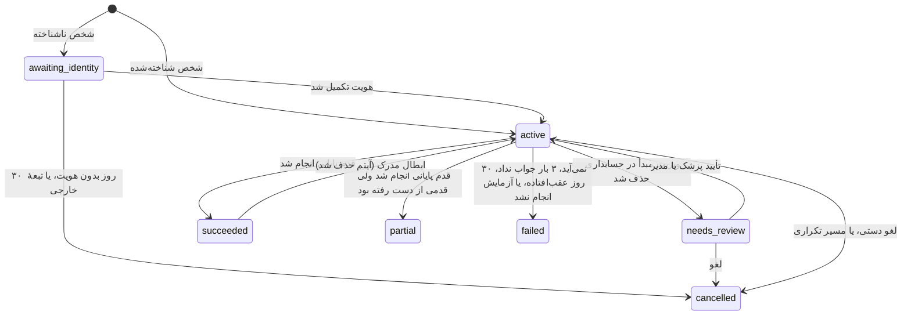
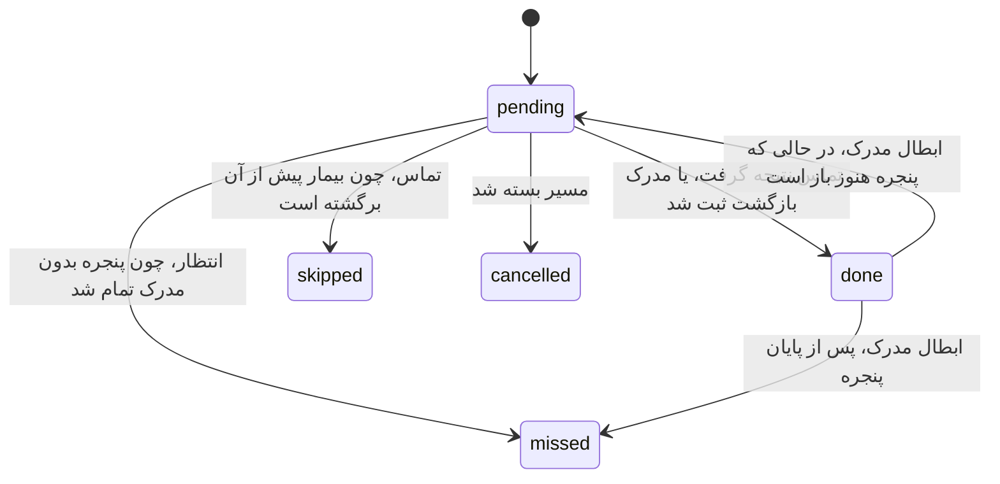

# ۰۵ — موتور مسیر، الگوها و تشخیص بازگشت

## ۱. مفاهیم

- **الگو** (`journey_template`) تعریف داده‌محور یک نوع پیگیری است. نسخه دارد و فقط مدیر آن را تغییر می‌دهد. مسیری که قبلاً ساخته شده، با همان نسخه‌ای که ساخته شده ادامه می‌دهد.
- **مسیر** (`journey`) یک نمونه از الگو برای یک شخص است. پارامترهای خودش را دارد؛ مثلاً پزشک تعداد نوبت‌ها را عوض کرده است.
- **قدم** (`journey_step`) دو نوع دارد:
  - **تماس** (`call`): در روز `due_date` وارد فهرست پذیرش می‌شود.
  - **انتظار** (`expect`): بین `due_date` و `window_end` انتظار خدمتی از دستهٔ `category` را دارد.
- **مدرک** (`return_evidence`) ارجاع به آیتم پرداخت‌شدهٔ حسابداری است که یک قدم انتظار را برآورده کرده است.

موتور سه نوع ورودی دارد و پردازش هر کدام idempotent است:
1. **رویدادهای پایشگر:** آیتم اضافه یا حذف شد، پرداخت ثبت یا برداشته شد، فاکتور بسته شد.
2. **کارهای کاربر:** ثبت پنل، ورود کاغذ پرستار، نتیجهٔ تماس، تکمیل هویت، اتصال دستی.
3. **تیک زمانی:** هر ۶۰ ثانیه و هنگام تغییر روز.

## ۲. ماشین‌های حالت





## ۳. قواعد عمومی موتور

| # | قاعده |
|---|---|
| G1 | **روز صفر** مسیر (`start_date`) برابر `work_date` فاکتور مبدأ است. همهٔ فاصله‌ها نسبت به آن روزشمارند. «یک ماه» یعنی ۳۰ روز (A16) |
| G2 | تماسی در «تماس‌های امروز» دیده می‌شود که `pending` باشد، `due_date <= today` باشد و مسیرش `active` باشد |
| G3 | **«نوبت گرفت»** (با تاریخ) تماس را `done` می‌کند. پنجرهٔ قدم انتظار بعدی می‌شود `[تاریخ نوبت، max(window_end، تاریخ نوبت + ۱)]`. اگر بیمار تا روز بعد از نوبت نیاید، یک تماس `no_show` با موعد «روز بعد از نوبت» ساخته می‌شود |
| G4 | **«جواب نداد»** شمارندهٔ تلاش را یکی زیاد می‌کند و موعد را فردا می‌گذارد. پس از ۳ تلاش، مسیر `failed` با علت `unreachable` می‌شود |
| G5 | **«نمی‌آید»** مسیر را `failed` با علت `refused` می‌کند. الگو می‌تواند این قاعده را عوض کند (`ear_wax_norx`، §۵) |
| G6 | **عقب‌افتاده** یعنی تماس `pending` با `due_date < today`. اگر بیش از ۳۰ روز بگذرد، مسیر `failed` با علت `expired` می‌شود |
| G7 | **قدم انتظاری که پنجره‌اش تمام شود** `missed` می‌شود. اگر الگو `recall_on_miss` داشته باشد، یک تماس `missed` با موعد فردا ساخته می‌شود |
| G8 | **پایان مسیر:** وقتی آخرین قدم انتظار `done` شود، مسیر `succeeded` می‌شود؛ اگر قدم انتظار دیگری `missed` شده بود، `partial` |
| G9 | **مسیر تکراری:** ساختن مسیر تازه از الگویی که شخص در آن مسیر باز دارد، مسیر قبلی را `cancelled` با علت `duplicate` می‌کند و مسیر تازه جایش را می‌گیرد |
| G10 | **مسیر `awaiting_identity`** هیچ تماسی تولید نمی‌کند. وقتی هویت تکمیل شود `active` می‌شود و موعدها عوض نمی‌شوند؛ تماسی که موعدش گذشته در عقب‌افتاده‌ها دیده می‌شود. اگر ۳۰ روز بدون هویت بماند، `cancelled` با علت `expired` می‌شود |
| G11 | **تبعهٔ خارجی** (پذیرش تأیید کند) مسیر را `cancelled` با علت `foreign` می‌کند (D24) |
| G12 | **حذف ویزیت مبدأ** در حسابداری مسیرهای آن پنل را `needs_review` می‌کند. تا تصمیم پزشک یا مدیر، هیچ تماسی ساخته نمی‌شود |
| G13 | **لغو دستی:** پزشک فقط مسیرهای خودش را لغو می‌کند، مدیر همه را. علت `manual` است و در لاگ ممیزی ثبت می‌شود |

## ۴. تطبیق بازگشت

| # | قاعده |
|---|---|
| M1 | **شخصِ یک فاکتور:** اول جدول اتصال (`person_acc_link`) بررسی می‌شود. اگر نبود و پروندهٔ حسابداری کد ملی معتبر داشت و شخصی با آن کد ملی وجود داشت، اتصال خودکار با روش `auto_nid` ساخته می‌شود. در غیر این صورت فاکتور ناشناس است |
| M2 | **آیتم معتبر** باید همهٔ این شرط‌ها را داشته باشد: حذف نشده باشد؛ دسته داشته باشد (03 §۹)؛ پرداخت شده باشد (`is_paid=1`، مبنای `paid`) **یا** فاکتورش بسته با مبلغ صفر باشد (مبنای `zero_total_closed`) |
| M3 | **فاکتور مبدأ** هرگز بازگشت حساب نمی‌شود، و آیتم باید `work_date > start_date` داشته باشد. پس خدمتی که همان روز ویزیت مبدأ گرفته شده، مثل تست قندی که پزشک خواسته، بازگشت نیست (A7) |
| M4 | **انتساب:** برای هر آیتم معتبر با دستهٔ c، قدم انتظار `pending` با دستهٔ c در مسیرهای فعال شخص انتخاب می‌شود؛ اولویت با کمترین `due_date` و بعد قدیمی‌ترین مسیر. شرط تاریخ: `due_date <= work_date <= window_end`، مگر قدم پرچم `accept_early` داشته باشد. در آن حالت بازگشت زودتر از موعد هم قبول است |
| M5 | **یک‌به‌یک:** هر آیتم حداکثر یک مدرک فعال دارد و هر قدم یک مدرک |
| M6 | **پس از ثبت مدرک:** قدم `done` می‌شود و تماس‌های `pending` قبلیِ همان مسیر `skipped` می‌شوند (C-4) |
| M7 | **ابطال مدرک:** اگر آیتم حذف یا پرداختش برداشته شود، مدرک `revoked` می‌شود. قدم اگر پنجره‌اش هنوز باز باشد به `pending` و اگر نه به `missed` برمی‌گردد. وضعیت مسیر دوباره محاسبه می‌شود |
| M8 | **ویزیت نزد هر پزشکی** بازگشت است (D20). «همان پزشک» یعنی `performer_staff_id = origin_doctor_staff_id`؛ فقط گزارش می‌شود و شرط نیست |
| M9 | **فاکتور ناشناس** (بیشتر مراجعه‌های پرستاری نام کامل ندارند) دو مسیر دارد: (۱) اگر ویزیت، تست قند یا کنترل فشار دارد، هشدار هویت می‌گیرد و با تکمیل هویت، M1 خودکار اتصال می‌دهد؛ (۲) پذیرش از «انتظار امروز» دستی وصلش می‌کند. پیشنهاد خودکار فقط وقتی ساخته می‌شود که موبایل پرونده با موبایل یک شخصِ مورد انتظار در ±۷ روز برابر باشد. تطبیق با نام خانوادگی به‌تنهایی پیشنهاد نمی‌سازد، چون نام‌هایی مثل «حسینی» صدها پرونده دارند |

## ۵. الگوها

قید «زودپذیر» یعنی قدم پرچم `accept_early` دارد. «فراخوان» یعنی قدم `recall_on_miss` دارد. همهٔ فاصله‌ها روز هستند و نسبت به روز صفر حساب می‌شوند.

### ۵-۱. تمدید نسخه — `renewal`
- **مبدأ:** پنل پزشک، با بازهٔ ۱، ۲ یا ۳ ماه. یا ورود کاغذ پرستار، با «مصرف دارو = بله» و تاریخ تقریبی تمدید.
- **موعد:** روز صفر + ۳۰ × ماه‌ها، یا تاریخی که بیمار گفته است.
- **قدم‌ها:**
  1. تماس `renewal_reminder` در موعد − ۱۰ روز (D15). اگر این تاریخ پیش از روز ۱ بیفتد، روز ۱.
  2. انتظار `visit` از روز ۱ تا موعد + ۳۰، زودپذیر.
- **ادامهٔ خودکار (A1):** وقتی موفق شود، یک مسیر `renewal` تازه با همان بازه ساخته می‌شود؛ روز صفرش تاریخ بازگشت و پزشک مبدأش پزشک انجام‌دهنده است. اگر پزشک در همان ویزیت بازگشت پنل را پر کند، طبق G9 انتخاب پزشک جایگزین می‌شود. اگر پزشک برچسب مزمن را بردارد یا تمدید را لغو کند، ادامه متوقف می‌شود.

### ۵-۲. آزمایش سه‌ماهه (دیابت) — `quarterly_lab`
- **مبدأ:** پنل پزشک، وقتی برچسب دیابت فعال است.
- **قدم‌ها:**
  1. تماس `quarterly_lab_reminder` در روز ۸۷، یعنی ۳ روز پیش از روز ۹۰ (A3).
  2. انتظار `visit` از روز ۱ تا روز ۱۲۰، زودپذیر.
- **ادامه:** مانند تمدید، هر ۹۰ روز ادامه پیدا می‌کند (A1). پزشک در ویزیت بازگشت، مسیر «آزمایش» را خودش انتخاب می‌کند.

### ۵-۳. سری کنترل فشار یا قند — `control_series_bp` و `control_series_bs`
- **مبدأ:**
  - پنل پزشک، با تعداد و فاصلهٔ قابل تغییر (پیش‌فرض: ۳ نوبت، هر روز یک‌بار؛ D14). این همان SMBG و SMBP در درمانگاه است (D13).
  - یا اقدام کات‌آف در ورود کاغذ پرستار.
- **قدم‌ها:** برای i از ۱ تا تعداد، یک انتظار `bp_check` (یا `bs_test`) در روز i × فاصله، با پنجرهٔ همان یک روز، و فراخوان. اندازه‌گیریِ روز صفر جزو سری نیست (A15).
- **تماس پیش از موعد ندارد.** فقط نوبتی که بیمار نیامده در فهرست تماس ظاهر می‌شود (A6).
- **نتیجه:** همهٔ نوبت‌ها انجام شود ← `succeeded`؛ بخشی ← `partial`؛ هیچ ← `failed` با علت `expired`.

### ۵-۴. آزمایش — `lab_order`
- **مبدأ:** پنل پزشک؛ چه بیمار درخواست کرده باشد، چه پزشک صلاح بداند.
- **قدم‌ها:**
  1. تماس `lab_check` در روز ۲ (D16).
  2. انتظار `visit` از روز ۱ تا روز ۳۰، زودپذیر. نوبت گرفتن پنجره را تمدید می‌کند (G3).
- **نتیجه‌های ویژهٔ تماس:**
  - «هنوز آزمایش نداده» (`lab_not_done`): تماس دوباره ۳ روز بعد. پس از ۳ بار، `failed` با علت `lab_not_done`.
  - «جواب آماده است»: همان «نوبت گرفت» با تاریخ (`booked`).
- **پیشنهاد نوبت:** برنامهٔ معمول پزشک مبدأ، و بعد «پزشکان پیگیری» (C-5).

### ۵-۵. جراحی سرپایی — `wound_care`
- **مبدأ:** فقط پنل پزشک. پرستار مسیر نمی‌سازد (D21).
- **پارامترها** (بدون پیش‌فرض؛ پزشک انتخاب می‌کند، A11):
  - روز کشیدن بخیه: گزینه‌های ۵، ۷، ۱۰ یا ۱۴، یا تاریخ دلخواه
  - فاصلهٔ تعویض پانسمان: هر ۱، ۲ یا ۳ روز، یا «ندارد»
- **قدم‌ها:**
  - انتظار `dressing` در روزهای k، 2k، … پیش از روز بخیه؛ هر پنجره دو روزه (`[d, d+1]`)، با فراخوان.
  - انتظار `suture_removal` در `[S, S+3]`، با فراخوان.
- **پایان:** با ثبت کشیدن بخیه، مسیر تمام می‌شود و جلسه‌های پانسمانِ باقی‌مانده `skipped` می‌شوند. پس از کشیدن بخیه پیگیری‌ای نیست (D21).

### ۵-۶. جرم گوش، قطره تجویز شد — `ear_wax_rx`
- **مبدأ:** پنل پزشک: «قطرهٔ گلیسیرین فنیکه تجویز شد».
- **قدم‌ها:**
  1. تماس `ear_wash_reminder` در روز ۳، با متن «فردا برای شستشو مراجعه کنید».
  2. انتظار `ear_irrigation` از روز ۴ تا روز ۱۴، با فراخوان (D18).

### ۵-۷. جرم گوش، قطره تجویز نشد — `ear_wax_norx`
- **مبدأ:** پنل پزشک: «تجویز نشد».
- **قدم‌ها:**
  1. تماس `ear_invite_visit` در روز ۱. متن تماس **فقط دعوت به ویزیت برای گرفتن نسخهٔ قطره** است و پذیرش هیچ دارویی پیشنهاد نمی‌دهد (D18، رعایت موارد قانونی).
  2. انتظار `visit` از روز ۱ تا روز ۲۱، زودپذیر.
- **جایگزینِ G5:** «نمی‌آید» مسیر را نمی‌بندد. تماس دوباره ۳ روز بعد گذاشته می‌شود («کم‌کم راضی کردن») و پس از ۳ بار «نمی‌آید»، مسیر `failed` با علت `refused` می‌شود (A4).
- **پس از بازگشت:** در ویزیت بازگشت، پنل به پزشک یادآوری می‌کند (P-8). اگر پزشک قطره تجویز کند و «تجویز شد» را بزند، مسیر `ear_wax_rx` ساخته می‌شود. این زنجیره عمداً خودکار نیست، چون نسخه را پزشک می‌نویسد.

### ۵-۸. تنفسی — `respiratory` (غیرفعال)
- **وضعیت:** تعریف می‌شود ولی `is_enabled = 0` است تا نبولایزر تهیه شود و خدمت «نبولایزر» در حسابداری تعریف شود (D25).
- **طرح اولیه:** بیمار با سرفهٔ خشک شدید یا تنگی نفس (مانند آسم و آلرژی)؛ تماس `respiratory_check` پس از درمان دارویی اولیه؛ اگر پاسخ نداده، دعوت و انتظار `nebulizer`.
- **جزئیات** (روز تماس و نتیجه‌های تماس) هنگام فعال‌سازی در فاز ۲ نهایی می‌شود (A5).

### ۵-۹. دعوت به ویزیت — `invite_visit`
- **مبدأ:** اقدام کات‌آف در ورود کاغذ پرستار.
- **قدم‌ها:**
  1. تماس `invite_visit` در روز ۱.
  2. انتظار `visit` از روز ۱ تا روز ۱۴، زودپذیر (A10).

## ۶. کات‌آف‌ها

پرستار و پذیرش فقط ثبت می‌کنند. اقدام را سامانه بر اساس کات‌آفی تعیین می‌کند که پزشک مدیر تأیید کرده است (D19، [ADR-0009](adr/0009-clinical-cutoffs.md)).

```json
{
  "bp": [
    { "when": { "any": [ { "metric": "systolic",  "gte": null }, { "metric": "diastolic", "gte": null } ] },
      "actions": [ "invite_visit", "control_series_bp" ] },
    { "when": { "any": [ { "metric": "systolic",  "gte": null }, { "metric": "diastolic", "gte": null } ] },
      "actions": [ "control_series_bp" ] }
  ],
  "bs": [
    { "when": { "all": [ { "metric": "glucose_type", "eq": "fasting" }, { "metric": "glucose", "gte": null } ] },
      "actions": [ "invite_visit" ] },
    { "when": { "all": [ { "metric": "glucose_type", "eq": "random" },  { "metric": "glucose", "gte": null } ] },
      "actions": [ "invite_visit" ] }
  ],
  "series": { "count": 3, "every_days": 1 }
}
```

- **مقدارهای عددی (`null`) عمداً خالی‌اند.** عدد بالینی را فقط پزشک مدیر تعیین می‌کند و این سند هیچ پیش‌فرض بالینی پیشنهاد نمی‌دهد. پیش‌نویسی که `null` داشته باشد قابل تأیید نیست.
- **ارزیابی:** قاعده‌ها از بالا به پایین بررسی می‌شوند و **اولین قاعدهٔ منطبق** اعمال می‌شود. عملگرهای مجاز: `gte`، `lte`، `eq`.
- **چرخهٔ تأیید:**
  1. مدیر یا پزشک مدیر پیش‌نویس (`draft`) را می‌نویسد.
  2. فقط پزشک مدیر تأیید (`approved`) می‌کند و نسخهٔ تأییدشدهٔ قبلی بازنشسته (`retired`) می‌شود.
  3. هر `walkin_entry` شناسهٔ نسخه‌ای را که بر آن اعمال شده نگه می‌دارد. تغییر نسخه روی ثبت‌های گذشته اثر ندارد.
- **پیش از اولین تأیید**، ورود کاغذ پرستار فقط ثبت می‌کند و بنر «کات‌آف تأیید نشده» نمایش داده می‌شود.
- **مسیر تمدید** مستقل از کات‌آف است: اگر «مصرف دارو = بله» باشد و تاریخ تمدید ثبت شود، همیشه ساخته می‌شود (W-4).

## ۷. قالب تعریف الگو

هر الگو در `journey_template.definition` یک JSON است. نسخهٔ اولیه از پوشهٔ `journeys/` بارگذاری می‌شود. مثال:

```json
{
  "code": "ear_wax_rx",
  "title": "جرم گوش — قطره تجویز شد",
  "enabled": true,
  "params": { "call_day": 3, "visit_day": 4, "window_days": 10 },
  "steps": [
    { "kind": "call",   "day": "{call_day}", "purpose": "ear_wash_reminder" },
    { "kind": "expect", "category": "ear_irrigation", "day": "{visit_day}",
      "window_days": "{window_days}", "recall_on_miss": true }
  ],
  "call_rules": { "no_answer_retry_days": 1, "max_attempts": 3, "refused": "close" }
}
```

- **سری‌ها** با `"repeat": { "count": "{count}", "every_days": "{every_days}" }` روی یک قدم انتظار تعریف می‌شوند.
- **`ear_wax_norx`** به‌جای `"refused": "close"` این را دارد: `"refused": { "retry_days": 3, "max": 3 }`.
- **متن تماس** هر `purpose` در تنظیمات است و مدیر می‌تواند ویرایشش کند. متن `ear_invite_visit` نباید نام دارو داشته باشد؛ این قید در اعتبارسنجی بررسی می‌شود.

## ۸. از پنل پزشک تا الگو

| گزینهٔ پنل | الگو و پارامتر |
|---|---|
| برچسب دیابت یا فشار | `chronic_tag`. از سابقه پیش‌پر می‌شود |
| تمدید نسخه: ۱م، ۲م، ۳م | `renewal` با `interval_months` |
| آزمایش سه‌ماهه (فقط با برچسب دیابت) | `quarterly_lab` |
| سری کنترل قند یا فشار (۳ نوبت، روزانه، قابل ویرایش) | `control_series_bs` یا `control_series_bp` |
| آزمایش نوشته شد | `lab_order` |
| جراحی سرپایی: روز بخیه و فاصلهٔ پانسمان | `wound_care` |
| جرم گوش: تجویز شد یا تجویز نشد | `ear_wax_rx` یا `ear_wax_norx` |
| تنفسی | تا فعال‌سازی پنهان است |
| بدون پیگیری | `encounter.decision = 'no_followup'` |

پنل مسیرهای باز شخص را هم نشان می‌دهد، مثلاً «تمدید — موعد ۱۴۰۵/۰۸/۱۲». پزشک می‌تواند آن‌ها را لغو کند یا با انتخاب دوباره جایگزین کند (G9).

## ۹. قواعد هویت (`identity_ok`)

هویت شخص یا پرونده وقتی معتبر است که همهٔ این‌ها برقرار باشد:
1. **کد ملی:** ۱۰ رقم، همهٔ رقم‌ها یکسان نباشند، و رقم کنترل درست باشد (همان الگوریتم `webapp/src/common/validators.py`).
2. **موبایل:** ۱۱ رقم که با 09 شروع شود.
3. **نام:** پس از نرمال‌سازی، نام کوچک دست‌کم ۲ حرف باشد و جزو این فهرست نباشد: «خ»، «ا»، «آ»، «آقا»، «اقا»، «آقای»، «خانم»، «خ.»، «ا.»، «بیمار»، «ناشناس». نام خانوادگی هم دست‌کم ۲ حرف باشد.
4. **تبعه نبودن:** علامت `is_foreign` در حسابداری به‌تنهایی رد نمی‌کند، چون برای بیمار ایرانیِ بدون کد ملی هم استفاده می‌شود (07 §۲). اگر پذیرش کد ملی ایرانی وارد کند، شخص معتبر است. اگر تأیید کند که بیمار تبعه است، هشدار با علت `foreign` بسته می‌شود.

## ۱۰. پیشنهاد نوبت

برای هر پزشک، از `acc_shift_staff` در ۱۲ هفتهٔ اخیر، ترکیب‌های «روز هفته × شیفت» استخراج می‌شود که او دست‌کم در نیمی از هفته‌ها حضور داشته است.

هنگام ثبت «نوبت گرفت»، این ترکیب‌ها به این ترتیب نمایش داده می‌شوند:
1. پزشک مبدأ
2. «پزشکان پیگیری»، که در تنظیمات تعریف می‌شوند (D20)

در ۱۲ هفتهٔ اخیر، در ۱۲ ترکیب از ۲۱ ترکیب ممکن یک پزشک ثابت دست‌کم ۷۵٪ مواقع حضور داشته است (07 §۵).
